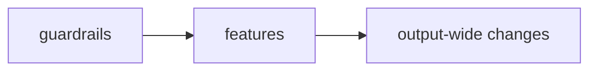

<!--
A plan is a parent issue. Its parts are NOT listed here:
- Create each part with the Task template and add it in the Sub-issues field.
- Record ordering as "blocked by" in the Relationships field, with the reason in a comment.
GitHub then shows the tree and the edges, and they can't drift from this text.

PRIVACY (BR-0001): this repo and its GitHub project are public. No page names, content,
people or dates from a personal graph; made-up examples and approximate aggregates only.

Delete these comments before you file.
-->

## Goal
<!-- What is true when this is done, in two or three sentences. -->

## Decisions
<!-- Choices already made, each with the reason. Mark any that still need the maintainer. -->
-

## Non-goals
<!-- Deliberately out. Prevents sub-issues from growing. -->
-

## Current state
<!-- Where the code is against the goal. Reference foundations section numbers. -->

Already conforming:
-

| Gap | Foundations | Severity |
|---|---|---|
| | | High / Low / Question |

<!--
Optional: how the parts relate, to orient a reader. The edges themselves live in GitHub.

-->

## Exit criteria
<!-- What closes the parent, beyond "all sub-issues done": a measurement, a doc update, a guard. -->
- [ ] All sub-issues closed
- [ ]

## Open questions
<!-- For the maintainer. Write "None" if there are none. -->
