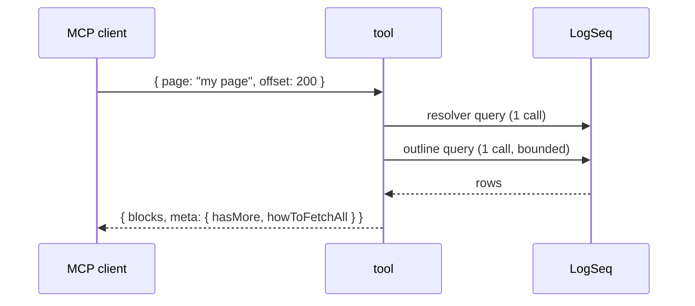

<!--
Write this so a fresh subagent, working alone in a worktree, needs nothing else. It will be
implemented against this text and reviewed against the Acceptance list.

PRIVACY (BR-0001): this repo and its GitHub project are public. Never put page names, block
content, people, journal dates or raw output from a personal graph in an issue. Use made-up
examples (Alice, "project atlas", 20250101) and approximate aggregates ("~2k-page graph").

Sequencing and grouping live in GitHub, not in this text:
- Make this a sub-issue of its parent (the Sub-issues field), don't write "Part of #N" as the only link.
- Mark hard ordering with "blocked by" (the Relationships field). Say why in a comment.
Delete these comments, and any section that truly doesn't apply, before you file.
-->

## Context
<!--
Why this exists, in a few sentences. Link what a reader must know:
the parent issue, the ADR or business rule (ADR-0007, BR-0006), and the
architecture-foundations.md section numbers it touches.

Example: "get_page_outline reports child counts, but a page with more than 200
top-level blocks is cut with a warning and no way to page on (ADR-0011, BR-0006).
Add an `offset` so a client can fetch the rest. Foundations 4.6 and 4.11."
-->

## Scope
<!-- What to change. One logical change. Bullets, each checkable. -->
-

## Out of scope
<!-- What NOT to touch, so the change doesn't grow. Name tempting neighbours. -->
-

## Where it lands
<!-- Files and anchors, so overlap with other open PRs can be checked before running in
parallel. Each new DatalogQueryBuilder method gets its own anchor and its own new test file. -->
| Area | File | Note |
|---|---|---|
| Query builder | `src/datalog/queries.ts` | new method after `pageOutlineBlocks` |
| Tool | `src/tools/<name>.ts` | |
| Args schema | `src/tool-args.ts` | |
| Tests | `src/tools/<name>.test.ts` (new) | |

## Design sketch
<!--
Optional but valuable: the shape you want, so the agent starts from your intent.
A short diagram of the call sequence or data flow, and the contract as a type or signature.
Uncomment and edit, or delete.



```typescript
// Additive only: existing callers see no change.
interface OutlineArgs { page: string; offset?: number }
```
-->

## Constraints that apply
<!-- Keep the ones this change can hit. Delete the rest. Each links to its source in CLAUDE.md or foundations. -->
- [ ] Inputs parsed with zod at the boundary (`src/tool-args.ts`, `parseArgs`)
- [ ] Strings bound with `:in`, ids embedded only through `groundIds`; page names lowercased
- [ ] Calls and result sizes are bounded; any cap reports `ResultMeta` (BR-0006, ADR-0011)
- [ ] No per-page crawls: one batched query, or `ground`-batched queries (Pattern 4)
- [ ] Infrastructure errors propagate; `null` is not `[]` (BR-0003, BR-0011)
- [ ] Tool contract changes are additive (foundations 4.3); `tools/list` snapshot reviewed (ADR-0016)
- [ ] Output is read-only, minified JSON; nothing writes to stdout (BR-0002, ADR-0009, ADR-0004)
- [ ] No graph data in code, tests, fixtures or docs (BR-0001); fixtures use made-up names

## Acceptance
<!-- Checkable outcomes. The reviewer subagent checks the PR against exactly this list. -->
- [ ]
- [ ] Tests cover the risky paths: empty result, malformed input, caps, infrastructure error

## Verification
<!-- Exact commands and the numbers the PR must report (approximate, no names). -->
```bash
npx tsc --noEmit
npx vitest run src
npx tsx scripts/logseq-instance.ts start && npm run test:integration && npx tsx scripts/logseq-instance.ts stop
npx tsx scripts/measure-api-calls.ts   # report calls for: <tool>
```

## Open questions
<!--
Anything the author couldn't settle. A subagent that finds the premise wrong, or an
ambiguity that would change a tool contract or output shape, stops and comments here
(foundations section 0). Other ambiguities: choose, and record under "Assumptions" in the PR.
Write "None" if there are none.
-->

## Definition of Ready
<!-- The maintainer's check before moving Backlog to Ready. Subagents: if one of these is
unmet, comment on the issue instead of starting. -->
- [ ] Scope is bounded and "Out of scope" names the neighbours
- [ ] Acceptance is checkable by someone who didn't write the issue
- [ ] Set as a sub-issue of its parent, and "blocked by" edges are set in GitHub, not only in prose
- [ ] No hidden ADR or business-rule change (if there is one, it has its own proposal issue)
- [ ] Size is set on the project board
