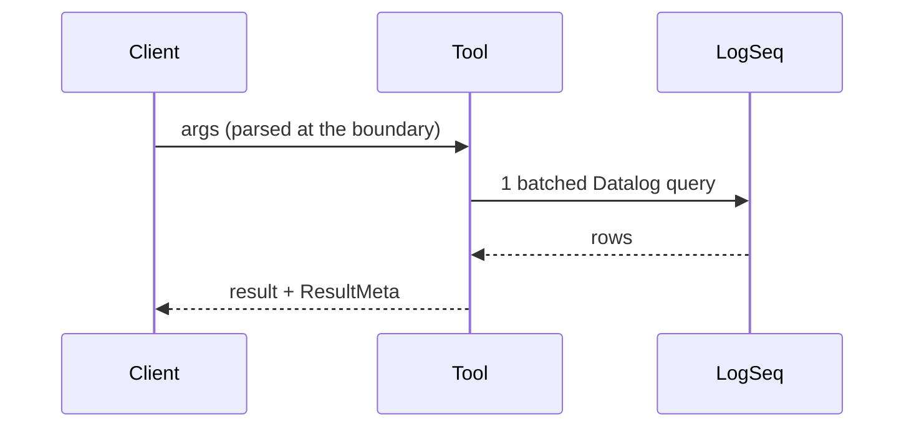

<!--
Fill every section. Be brief and factual: a reviewer reads this before the diff.
Write "None" or "N/A" rather than deleting a section.

PRIVACY (BR-0001): this repo and its GitHub project are public. Don't paste page names,
block content, people, journal dates or raw output from a personal graph, here or in
review replies. Use made-up names (Alice, "project atlas") and approximate aggregates
("~2k-page graph", "~120 API calls").
-->

## What changed
<!-- One or two sentences. One logical change. -->

Closes #

## Design
<!-- Data shapes, contract changes and approach, and why. A diagram or a short
type/signature snippet is welcome when it shows the flow better than prose.

-->

## Assumptions
<!-- Each place you resolved an ambiguity yourself, and what you chose. If an ambiguity
would change a tool contract or output shape, you should have stopped and asked on the
issue instead (architecture-foundations.md, section 0). -->

## Failure behavior
<!-- For each boundary: timeout, LogSeq not running, bad auth, malformed input,
empty result, oversized result. -->

## Preserved on purpose / questions
<!-- Safeguards or odd behavior you kept, and suspected bugs you did not fix. -->

## New concepts
<!-- New tools, parameters, dependencies or abstractions, and why each is needed.
"None" is a good answer. -->

## Test plan
<!-- Tests added, and what each one pins. Measurements are approximate, no graph data. -->
- [ ] Tests added: <what each pins>
- [ ] `cd rust && cargo test --locked` passes
- [ ] `npx vite-node scripts/parity.ts` and its `--self-check` pass against the debug build (`cd rust && cargo build`)
- [ ] `npm run typecheck` and `npx vitest run tests/guards tests/rust-guards` pass
- [ ] `npm run test:integration` passes against this worktree's fixture instance, and `git status` shows no change under `tests/fixtures/graph/`
- [ ] `npx tsx scripts/measure-api-calls.ts` still runs. Approximate calls before/after: <n / n>
- [ ] Privacy grep done on the diff, commit messages and this description: no names or content from the personal graph (pass/fail only, no output pasted)

### If it applies (tick, or write N/A)
- [ ] **ADR or business rule added, changed, superseded or retired**: this PR needs the maintainer's explicit OK before merge. A changed rule has a new Changelog row citing this PR. (An additive-only Mechanical enforcement edit needs no OK; say so here.)
- [ ] **Tool contract changed**: additive only, the diff of `scripts/parity/expected/` reviewed (a PR that changes it needs the maintainer's OK and the `golden-change` label), tool-list budget respected (ADR-0016)
- [ ] **API call count or behavior of a tool changed**: "Current Implementation Status" table in `CLAUDE.md` updated
- [ ] **New tool**: the "When Adding New Tools" checklist in `CLAUDE.md` is done

## Roll back
<!-- How to undo the change. -->
